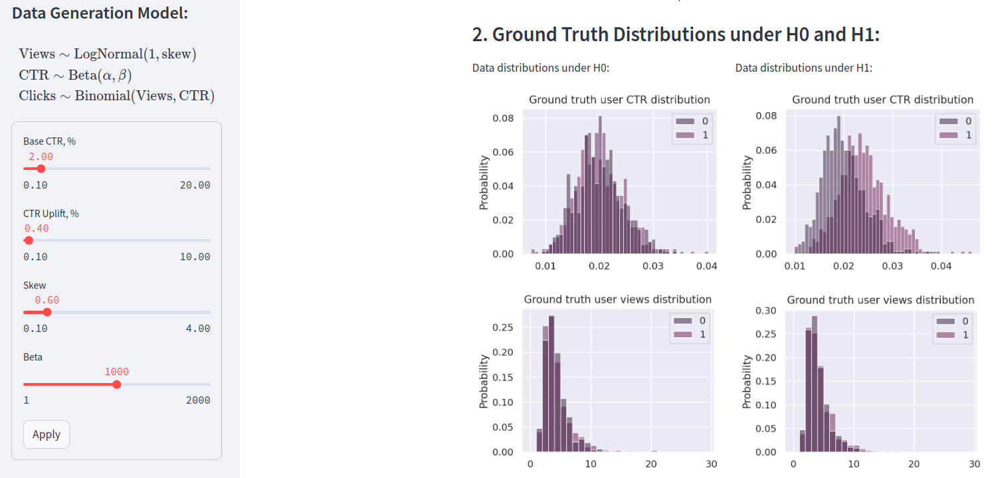

# Streamlit AB-test Simulator

This Streamlit app allows you to simulate A/B tests for evaluating the performance of different versions of a web page or application. It generates synthetic data for A/B testing based on user-defined parameters and provides various statistical analyses and visualizations to interpret the results.

<div align="center">
  
</div>

## Features

- **Data Generation Model:** Customize the parameters for generating synthetic data including base click-through rate (CTR), CTR uplift, skewness, and beta distribution parameters.
- **Experiment Design:** Specify the significance level, power, and minimum detectable effect to design your A/B tests.
- **Ground Truth Distributions:** Visualize the distributions of CTR and views for control and treatment groups under the null and alternative hypotheses.
- **A/B Tests Results:** Conduct various statistical tests including t-tests, Mann-Whitney U tests, and binomial tests to compare the performance of control and treatment groups. Visualize the distributions and empirical cumulative distribution functions (CDFs) of p-values.
- **Statistical Power Analysis:** Evaluate the statistical power of the conducted tests to detect significant differences between groups.

## How to Use

1. **Data Generation Model:** Adjust the sliders in the sidebar to customize the parameters for generating synthetic data.
2. **Experiment Design:** Set the significance level, power, and minimum detectable effect for designing your A/B tests.
3. **Click "Apply"** to generate the synthetic data and estimate the parameters.
4. **Review Ground Truth Distributions:** Examine the distributions of CTR and views under the null and alternative hypotheses.
5. **Conduct A/B Tests:** Explore the results of various statistical tests and visualizations.
6. **Interpret Results:** Analyze the p-value distributions and statistical power to draw conclusions about the effectiveness of the tested variations.

## Installation

To run this Streamlit app locally, follow these steps:

1. Clone this repository:

```bash
git clone https://github.com/insdout/AB-test-simulator.git
```

2. Navigate to the project directory:

```bash
cd AB-test-simulator
```

3. Install the required dependencies:

```bash
pip install -r requirements.txt
```

4. Run the Streamlit app:

```bash
streamlit run streamlit_app.py
```

5. Access the app in your web browser at [http://localhost:8501](http://localhost:8501).
